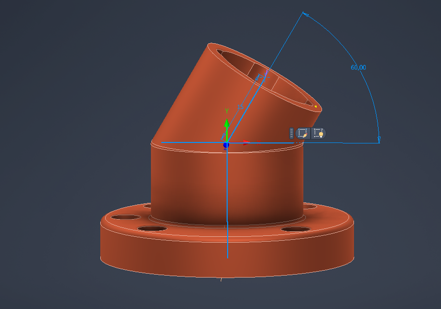

# Laboratorio 1 - Robótica Industrial
En este carpeta se encuentra los archivos sosportes del laboratorio 1 de la asignatura Robótica en el pregrado de Ingeniería mecatrónica en la Universidad Nacional de Colombia
## Diseño de la Herramienta

En el diseño de la herramienta, se basó en los datos geométricos en la documentación del fabricante del Robot ABB - modelo IRB140, en la cual se obtuvo los diámetros de la herramienta, los agujeros de sujeción al robot entre otros.
Por otro lado,  se dialogó con el docente y compañeros/as de la asignaturas, los cuales se entendió sobre las posibles singularidades que pueden tener si la herramienta no presenta inclinación; por ende, se realizó un diseño que presentara una inclinación de 60 grados con respecto al eje y de la herramienta, como se observa en la figura  de acontinuación

Figura

## Solución Planteada
