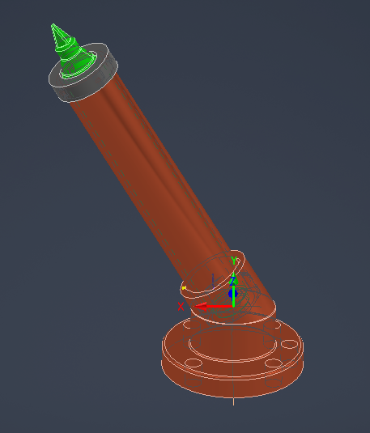

# Laboratorio 1 - Robótica Industrial
En este carpeta se encuentra los archivos sosportes del laboratorio 1 de la asignatura Robótica en el pregrado de Ingeniería mecatrónica en la Universidad Nacional de Colombia
## Diseño de la Herramienta

En el diseño de la herramienta, se basó en los datos geométricos en la documentación del fabricante del Robot ABB - modelo IRB140, en la cual se obtuvo los diámetros de la herramienta, los agujeros de sujeción al robot entre otros.
Por otro lado,  se dialogó con el docente y compañeros/as de la asignaturas, los cuales se entendió sobre las posibles singularidades que pueden tener si la herramienta no presenta inclinación; por ende, se realizó un diseño que presentara una inclinación de 60 grados con respecto al eje y de la herramienta, como se observa en la figura que se muestra en seguida.

](recursos_multimedia/anguloInclinacion.png).

Adicionalmente, para tener en cuenta las variaciones del marcador en el eje z se colocó un resorte en el fondo de la herramienta.

El diseño se modeló en el Software Inventor Profesional 2024, la herramienta diseñada se compone de dos  piezas,  la base fijo al robot ABB, con un eje de guia en las primeras espiras del resorte alineado a 60° respecto respecto al eje z de el portaherramientas; la otra pieza es un cilindro que sostiene el marcador; por otro lado, haciendo uso del calibrador pie de Rey, se modelado el marcador Edding; el ensable de la herramienta se presenta a continuación:

Luego, la impresión se realizó en el laboratorio de Mecatrónica de la Universidad Nacional de Colombia se realizó la impresión de las piezas, las cuales se pueden ver en la siguiente figura:

## Solución Planteada

## Programación de la trayectoria
Una vez definida la herramienta (con su respectivo marco de referencia) se uso el modelo "Tableros" como base para definir la trayectoria que se seguira, tomando como base los tableros inclinados presentes en el laboratorio. Se creo un Work Object en la esquina superior del objeto, de tal manera que el plano xy comprende toda la cara donde estan las letras y el eje z positivo entra al tablero.

Para programar la trayectoria se crearon una serie de puntos en todos los vertices de las letras y de la decoración, para las curvas se incluyó también el punto medio. Los puntos siguen una secuencia logica e incluyen la aproximación, alejamiento y desplazamiento a cada objeto. Con los puntos se creo una trayectoria en donde se tuvieron en cuenta los requisitos de presición y velocidad. Para desplazarse entre letras se usó la instrucción MoveJ, para las lineas se uso la instruccción MoveL y para las curvas se usaron los desplazamientos de inicio-medio y medio-fin de las curvas para formar una instrucción MoveC.

Posteriormente se movio el robot a lo largo de la trayectoria para corregir errores de singularidad, alcance y orientación de la herramienta. Una vez todo estuvo correcto se sincronizo la trayectoria en RAPID, incluyendo las instancias de la herramienta y el objeto de trabajo.
