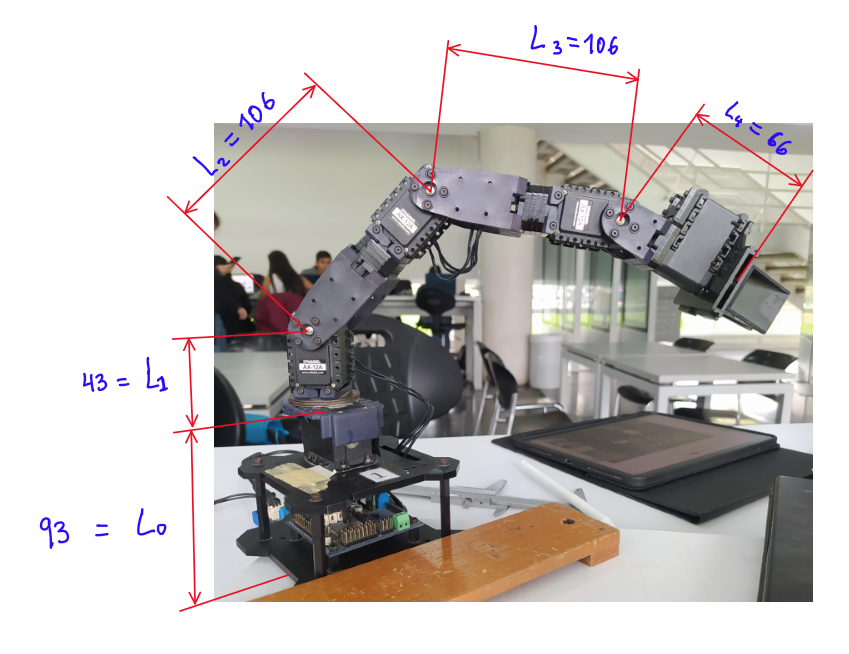
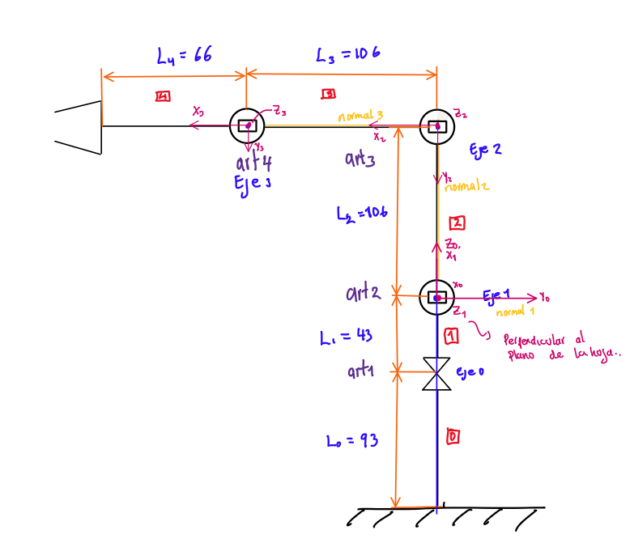

# Informe del laboratorio:
Integrantes del equipo: 
 - Jonathan Leoanrdo Begambre Rodríguez.
 - Carlos Caucalí
   
## Solución planteada:
Para iniciar con este laboratorio se realizó la medición del robot , para obtener una aproximación de las medidas de los eslabones, para ello se utilizó y se establecieron las siguientes medidas que se muestran en la figura presentada en seguida: 

 Posteriormente, se  realizó el procedimiento para obtener los parámetros de Denavit Hartenberg como se muestra a continuación:

 Luego se verifica con Matlab y se genera la tabla de DH como se muestra a contiuación:
 
 Diagrama en Matlab del Robot Phantom:
 
 

## V´ıdeos del Robot Alcanzando las posiciones deseadas :
A continuación se muestra la prueba con los diferentes Motores para calibrar los rangos:

Prueba de Regreso a Home:
<video src="VideosEditados/PruebaMovHomePose2.mp4" controls title="Title"></video>

https://github.com/jlbegambrer/Robotic-Laboratory-2023-2/assets/70650382/5eefbca0-9850-4951-bca9-bc1229fb4ac9
Prueba de Home a Pose2:
 <video src="VideosEditados/PruebaMovHomePose2.mp4" controls title="Title"></video>
 
https://github.com/jlbegambrer/Robotic-Laboratory-2023-2/assets/70650382/8e7ff75d-c301-429e-8c17-d6b4fdb05dac

Prueba de Pose 2 a Pose 3: 
 <video src="VideosEditados/PruebaMovPose2aPose3.mp4" controls title="Title"></video>
 
https://github.com/jlbegambrer/Robotic-Laboratory-2023-2/assets/70650382/fe560237-d078-4589-967d-55fa84488655

Prueba de Pose 3 a Pose 4: 

<video src="VideosEditados/PruebaMovPose3aPose4.mp4" controls title="Title"></video>

Prueba de Pose 4 a Pose 5: 

https://github.com/jlbegambrer/Robotic-Laboratory-2023-2/assets/70650382/b9e998fc-d8e9-4fa9-bcff-bfe0bb94da13

<video src="VideosEditados/PruebaMovPose4aPose5.mp4" controls title="Title"></video>

Prueba de las 5 Pases:

https://github.com/jlbegambrer/Robotic-Laboratory-2023-2/assets/70650382/5422f39a-9dac-44e6-90f6-35426a52d6ff

<video src="Multimedia/Prueba%205%20posesv1.mp4" controls title="Title"></video>
