# Informe del laboratorio:
Integrantes del equipo: 
 - Jonathan Leoanrdo Begambre Rodríguez.
 - Carlos Caucalí
   
## Solución planteada:
Para iniciar con este laboratorio se realizó la medición del robot , para obtener una aproximación de las medidas de los eslabones, para ello se utilizó y se establecieron las siguientes medidas que se muestran en la figura presentada en seguida: 

 Posteriormente, se  realizó el procedimiento para obtener los parámetros de Denavit Hartenberg como se muestra a continuación:

 Luego se verifica con Matlab y se genera la tabla de DH como se muestra a contiuación:
 
 Diagrama en Matlab del Robot Phantom:
 
 

## Códigos en Matlab Implementados:

En esta sección se mostrará los códigos y las principales funciones los cuales pueden ser verificados en la llamda "Laboratorio4_Codigos".

### Código de la estructura  - L+ogica del proceso:
#### Configuración Inicial del código de la lógica general del Laboratorio:

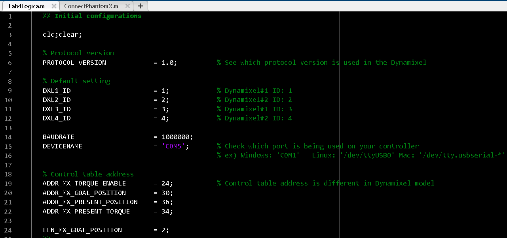

#### Fragmento del código que conecta al PhantomX:

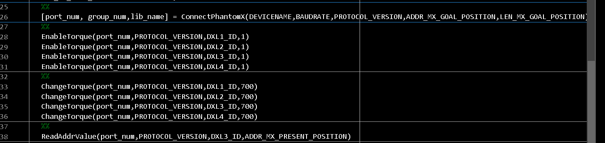

#### Movimiento de Poses:

Se muestra el fragmento del llamado a Mov2pose para realizar las diferentes poses en el Robot PhantomX.

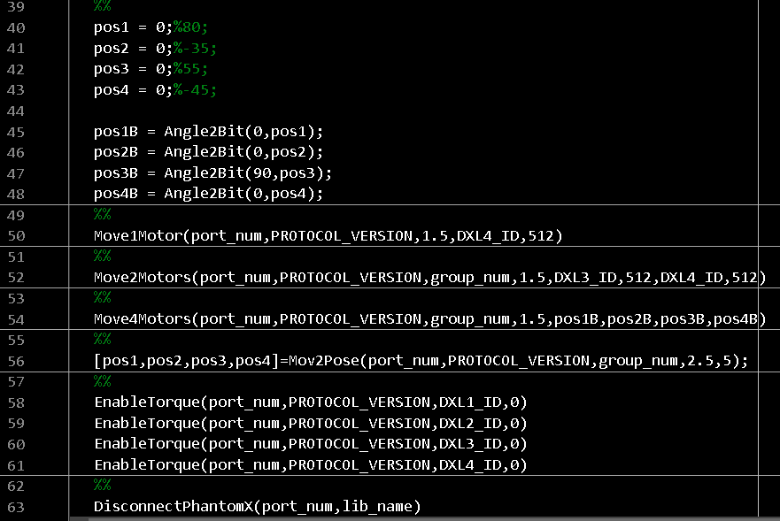

## Funciones Implementadas en el Laboratorio:
###  Función Mov2Pose
Se muestra el encabezado de la función Mov2Pose con los argumentos y salidas de la función.

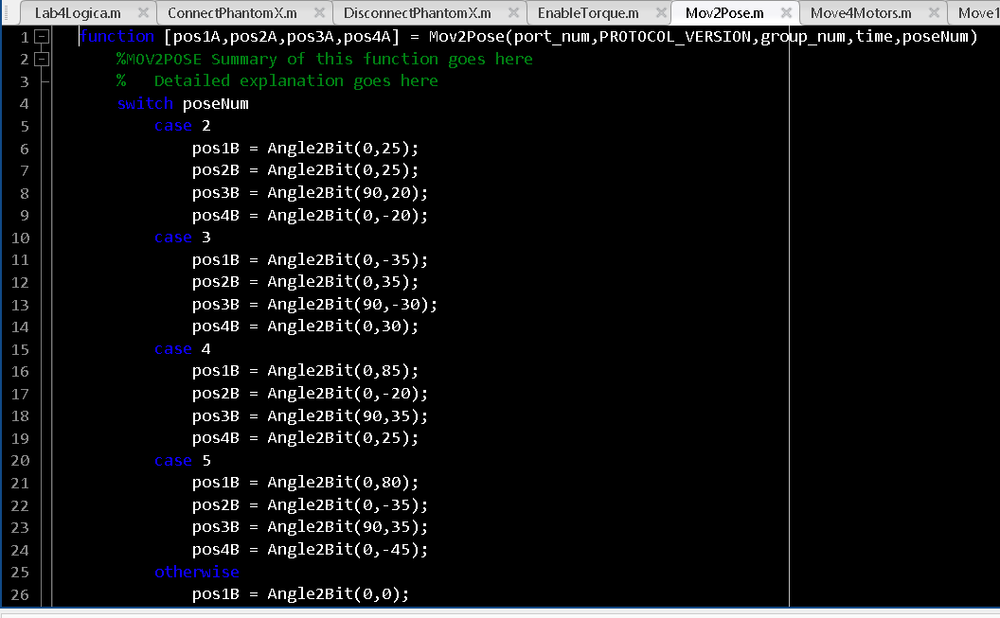

### Connect PhantomX - Función Usada:
Función usada para establecer la conexión con el Robot PhantomX 
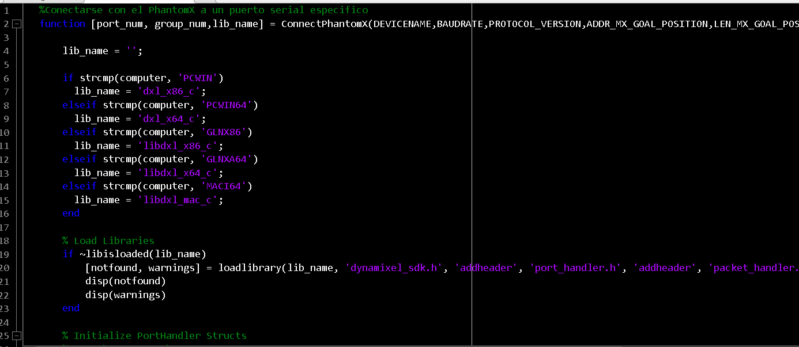

###  Disconnect PhantomX :
 
 Función usada para finalizar la conexión con el Robot PhantomX.
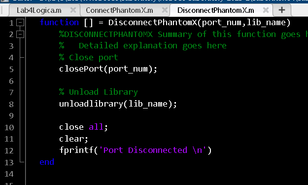

### Mov4Motors:
Función que mueve los 4 servos, se muestra el encabezado a continuación:

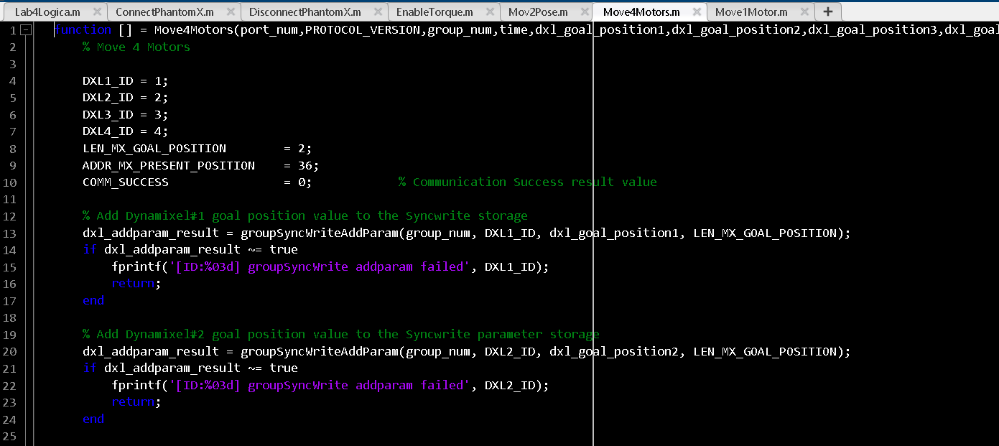

## Poses Generadas en Matlab:
Para las poses se usó el serial link y se realiza la configuración de cada una de las posiciones, esto se muestra a continuación: Cabe destacar que las poses 5 y 4  se les hizo un ajuste para evitar que se golpeara con el suelo, se cambió el valor de 55 por 35 en q3.
Los cuales quedaría así:

1. 0, 0, 0, 0, 0. (Home)
2. 25, 25, 20, -20, 0.
3. -35,35, -30, 30, 0.
4. 85, -20, 35, 25, 0.
5. 80, -35, 35, -45, 0

Las poses se muestran a continuación: 
 
### Pose de Home en Matlab : 
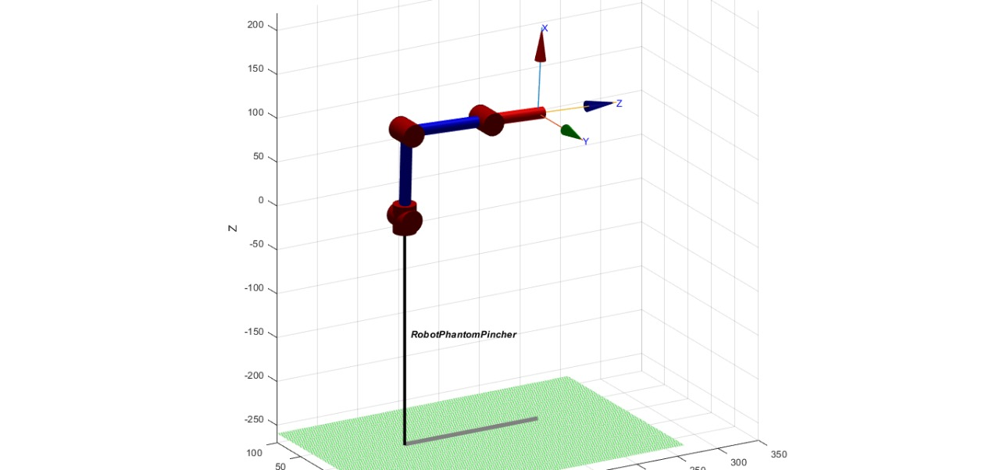

#### Pose 2 :
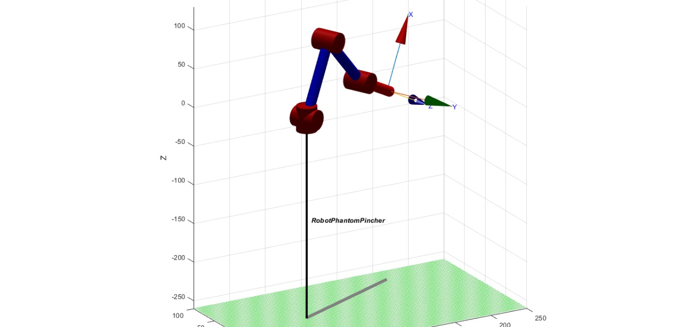

### Pose 3 :
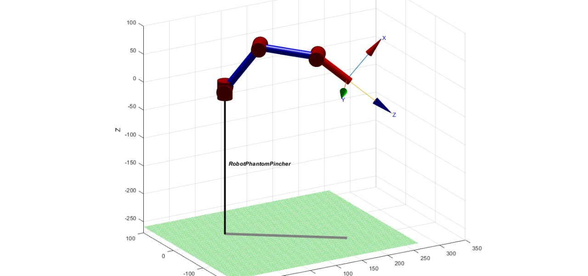

### Pose 4:

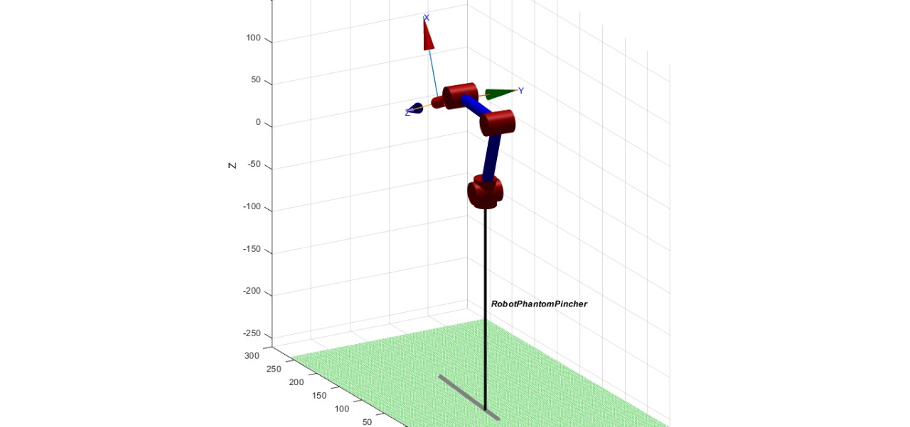

### Pose 5:

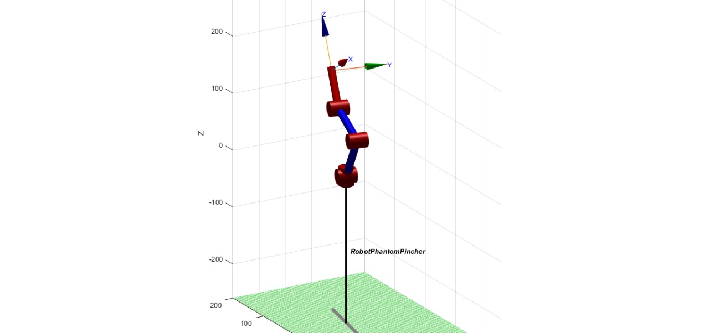

## Videos del Robot Alcanzando las posiciones deseadas :
A continuación se muestra la prueba con los diferentes Motores para calibrar los rangos:

Prueba de Regreso a Home:

<video src="VideosEditados/PruebaMovHomePose2.mp4" controls title="Title"></video>

https://github.com/jlbegambrer/Robotic-Laboratory-2023-2/assets/70650382/5eefbca0-9850-4951-bca9-bc1229fb4ac9

Prueba de Home a Pose2:
 <video src="VideosEditados/PruebaMovHomePose2.mp4" controls title="Title"></video>
 
https://github.com/jlbegambrer/Robotic-Laboratory-2023-2/assets/70650382/8e7ff75d-c301-429e-8c17-d6b4fdb05dac

Prueba de Pose 2 a Pose 3: 
 <video src="VideosEditados/PruebaMovPose2aPose3.mp4" controls title="Title"></video>
 
https://github.com/jlbegambrer/Robotic-Laboratory-2023-2/assets/70650382/fe560237-d078-4589-967d-55fa84488655

Prueba de Pose 3 a Pose 4: 

<video src="VideosEditados/PruebaMovPose3aPose4.mp4" controls title="Title"></video>

https://github.com/jlbegambrer/Robotic-Laboratory-2023-2/assets/70650382/7dfe52df-c4be-44da-a6b6-b04b42b9372f

Prueba de Pose 4 a Pose 5: 

https://github.com/jlbegambrer/Robotic-Laboratory-2023-2/assets/70650382/b9e998fc-d8e9-4fa9-bcff-bfe0bb94da13

<video src="VideosEditados/PruebaMovPose4aPose5.mp4" controls title="Title"></video>

Prueba de las 5 Pases:

https://github.com/jlbegambrer/Robotic-Laboratory-2023-2/assets/70650382/5422f39a-9dac-44e6-90f6-35426a52d6ff

<video src="Multimedia/Prueba%205%20posesv1.mp4" controls title="Title"></video>

##  Comparación de poses Digitales Vs del Phantom:
 
###  Comparación de Pose de Home: Imágen del Robot Real Vs Digital. 

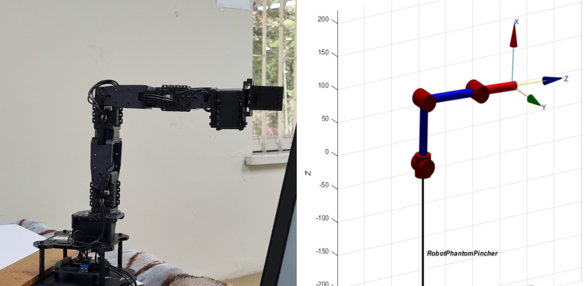

###  Comparación de Pose 2: Imágen del Robot Real Vs Digital. 

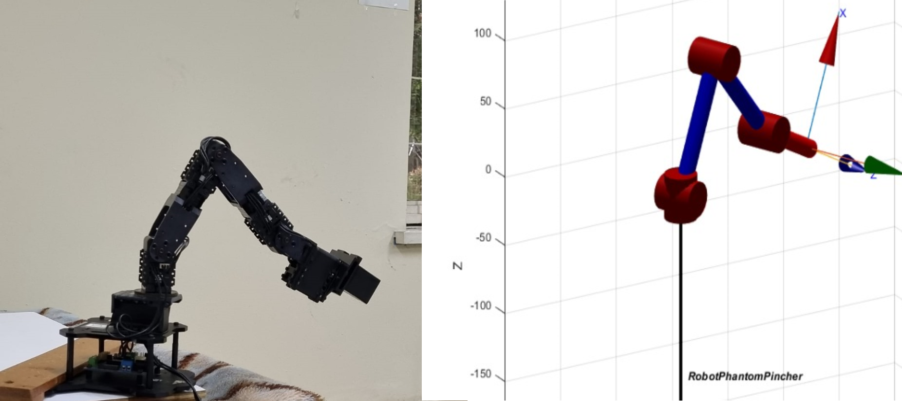

###  Comparación de Pose 3: Imágen del Robot Real Vs Digital. 

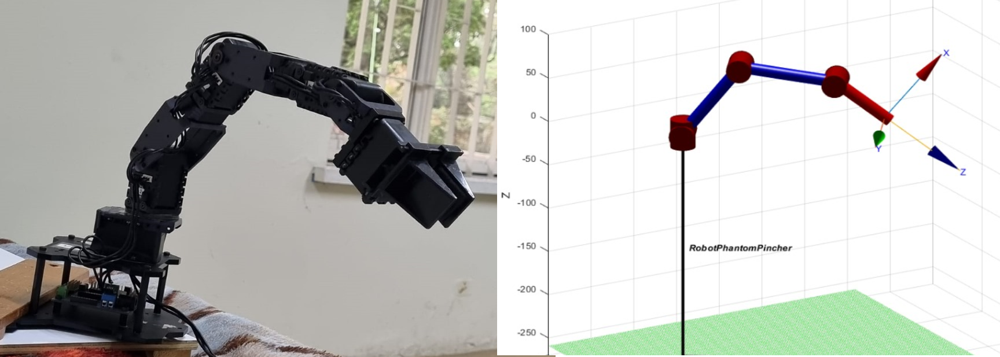

###  Comparación de Pose 4: Imágen del Robot Real Vs Digital. 

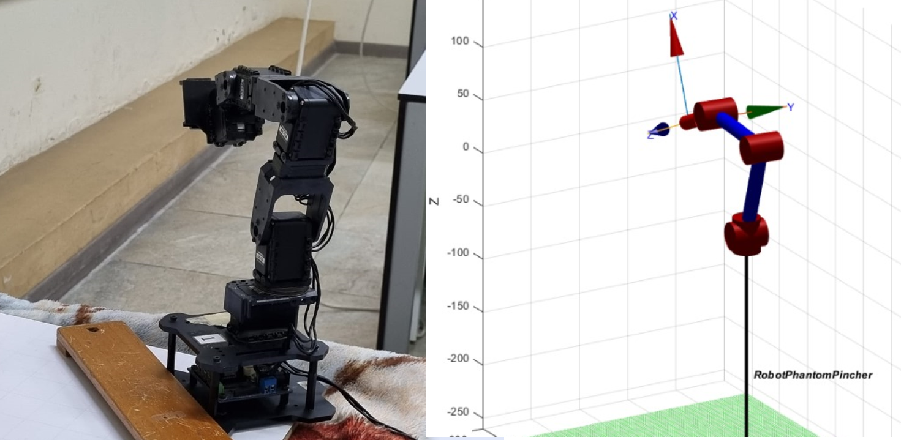

###  Comparación de Pose 5: Imágen del Robot Real Vs Digital. 

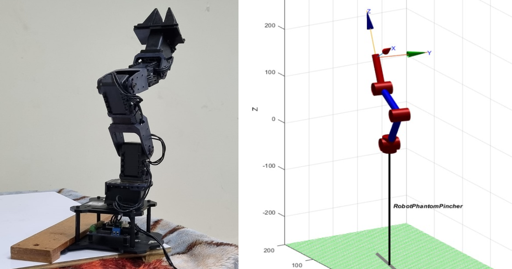

